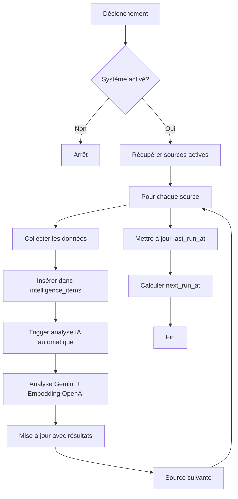

# 🦅 Système de Veille Automatique - Lynx Eye

## Vue d'ensemble

Le système de veille automatique collecte automatiquement des informations depuis les sources configurées (RSS, réseaux sociaux, etc.) et les analyse avec l'IA pour générer des insights stratégiques.

## ✨ Fonctionnalités

- ⚙️ **Configuration personnalisable** : Fréquence, réseaux sociaux actifs
- 🔄 **Collecte automatique** : Scraping périodique selon la configuration
- 🧠 **Analyse IA automatique** : Chaque item collecté est analysé (résumé, catégorie, sentiment, entités)
- 📊 **Interface de gestion** : Dashboard complet dans l'espace Admin
- 🎯 **Suivi en temps réel** : Dernière et prochaine collecte visibles

## 📋 Sources surveillées

Le système surveille actuellement :
- **RSS** : Sources d'actualités gabonaises
- **Facebook** : Recherches sur "Gabon"
- **TikTok** : Contenus liés au Gabon
- **YouTube** : Vidéos sur le Gabon
- **X (Twitter)** : Mentions du Gabon

## 🎛️ Configuration

### Via l'interface Admin

1. Allez dans **Admin Space** → **Lynx Eye** → **Configuration**
2. Configurez :
   - **Système actif** : Activer/désactiver la collecte
   - **Fréquence** : Intervalle en heures (par défaut: 72h = 3 jours)
   - **Réseaux sociaux** : Activer/désactiver chaque réseau
3. Cliquez sur **Enregistrer**
4. Utilisez **Lancer maintenant** pour une collecte immédiate

### Configuration par défaut

```json
{
  "enabled": true,
  "frequency_hours": 72,
  "social_networks": {
    "facebook": true,
    "tiktok": true,
    "youtube": true,
    "x": true
  }
}
```

## 🚀 Mise en place du Cron Job

Pour automatiser complètement la collecte, vous devez configurer un cron job Supabase :

### Option 1 : Via SQL Editor

1. Ouvrez votre projet Supabase
2. Allez dans **SQL Editor**
3. Ouvrez le fichier `scripts/intelligence/setup_cron_supabase.sql`
4. **Remplacez les variables** :
   - `YOUR_PROJECT_URL` → URL de votre projet (ex: https://xxxxx.supabase.co)
   - `YOUR_ANON_KEY` → Votre clé anon (Settings > API)
5. Exécutez le script

### Option 2 : Configuration manuelle

```sql
SELECT cron.schedule(
    'intelligence-scraping-check',
    '0 * * * *',  -- Toutes les heures
    $$
    SELECT
      net.http_post(
          url:='https://votre-projet.supabase.co/functions/v1/trigger-intelligence-scraping',
          headers:='{"Content-Type": "application/json", "Authorization": "Bearer votre-cle-anon"}'::jsonb,
          body:='{}'::jsonb
      ) as request_id;
    $$
);
```

### Vérification du cron

```sql
-- Voir le job
SELECT * FROM cron.job WHERE jobname = 'intelligence-scraping-check';

-- Voir l'historique d'exécution
SELECT * FROM cron.job_run_details 
WHERE jobid = (SELECT jobid FROM cron.job WHERE jobname = 'intelligence-scraping-check')
ORDER BY start_time DESC LIMIT 10;
```

## 🔄 Fonctionnement

### 1. Déclenchement
- **Automatique** : Le cron job vérifie toutes les heures
- **Manuel** : Bouton "Lancer maintenant" dans l'interface

### 2. Processus de collecte



### 3. Analyse automatique

Chaque item collecté déclenche automatiquement :
- **Analyse Gemini** : Résumé, catégorie, sentiment, entités
- **Embedding OpenAI** : Vectorisation pour recherche sémantique
- **Logs** : Suivi dans `intelligence_processing_logs`

## 📊 Surveillance

### Dashboard Intelligence

- **Données Capturées** : Nombre total d'items vectorisés
- **Sources Actives** : Canaux d'écoute opérationnels
- **Alertes 24h** : Signaux faibles ou critiques

### Logs de traitement

```sql
-- Voir les derniers traitements
SELECT * FROM intelligence_processing_logs
ORDER BY started_at DESC
LIMIT 20;

-- Voir les erreurs
SELECT * FROM intelligence_processing_logs
WHERE status = 'error'
ORDER BY started_at DESC;
```

## 🔧 Personnalisation

### Ajouter une source

```sql
INSERT INTO intelligence_sources (name, type, url, status)
VALUES ('Nouvelle Source', 'rss', 'https://example.com/feed', 'active');
```

### Modifier la fréquence

Via l'interface Admin ou directement :

```sql
UPDATE intelligence_scraping_config
SET frequency_hours = 48  -- 2 jours
WHERE id = '00000000-0000-0000-0000-000000000001';
```

## 🚨 Dépannage

### Le cron ne s'exécute pas

1. Vérifier que `pg_cron` est activé :
```sql
SELECT * FROM pg_extension WHERE extname = 'pg_cron';
```

2. Vérifier les credentials dans le cron job

### Pas de données collectées

1. Vérifier que le système est activé
2. Vérifier les logs :
```sql
SELECT * FROM intelligence_processing_logs
WHERE status = 'error';
```

3. Tester manuellement :
   - Cliquez sur "Lancer maintenant" dans l'interface

### Erreurs d'analyse IA

- Vérifier que `GEMINI_API_KEY` et `OPENAI_API_KEY` sont configurés
- Consulter les logs de l'Edge Function `process-intelligence`

## 📝 Notes importantes

- **Performance** : Le scraping de réseaux sociaux est simulé actuellement. Pour une vraie collecte, vous devrez :
  - Utiliser les APIs officielles (Facebook Graph API, Twitter API, etc.)
  - Implémenter des scrapers externes avec des bibliothèques comme Puppeteer
  - Respecter les CGU et limites de rate des plateformes

- **Coûts** : Chaque analyse consomme des crédits API (Gemini + OpenAI)

- **Sécurité** : Les clés API sont stockées de manière sécurisée dans les Secrets Supabase

## 🔗 Ressources

- [Documentation Supabase Cron](https://supabase.com/docs/guides/database/extensions/pg_cron)
- [Guide de déploiement complet](./README_DEPLOYMENT.md)
- [Configuration des sources](./sources.py)
